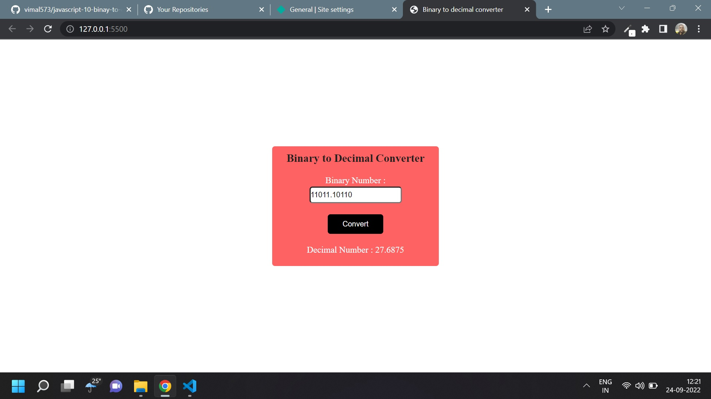

# Javascript Assignment Binary to decimal converter

## Binary to Decimal converter [Live Link](https://name-conversion-js.netlify.app/)

- Skills Gained in this project

  - use array methods to convert binary to decimal

  - use condition and \*\* oprater

---

## Time taken to finish this project

- 1 hour 45 minutes to complete it

#### Screenshot

